# SamadhanX System Architecture

## Overview

SamadhanX is designed as a **modular monolith** that connects citizens, government agencies, universities, and industry partners to systematically solve societal challenges through innovation and collaboration. The architecture supports the complete lifecycle from challenge submission to impact measurement.

## Architecture Principles

### 1. **Modular Monolith Design**
- Single deployable unit with clear internal boundaries
- Domain-driven module separation
- Ability to extract modules to microservices in the future
- Shared database with well-defined schemas

### 2. **Scalability & Performance**
- Horizontal scaling through load balancers
- Database read replicas for query optimization
- Caching layers for frequently accessed data
- Async processing for heavy operations (AI analysis)

### 3. **Security & Privacy**
- Role-based access control (RBAC) throughout the system
- JWT-based authentication with refresh tokens
- Input validation and sanitization at all layers
- Audit logging for compliance and monitoring

### 4. **Maintainability & Extensibility**
- Clean architecture with separation of concerns
- Dependency injection for loose coupling
- Comprehensive testing strategy
- Documentation-driven development

## System Context Diagram

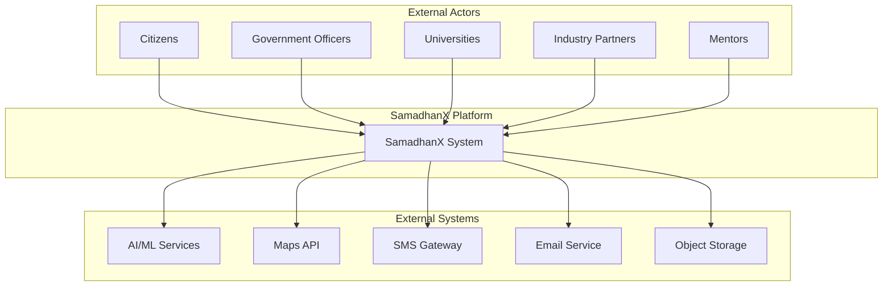

## High-Level Architecture

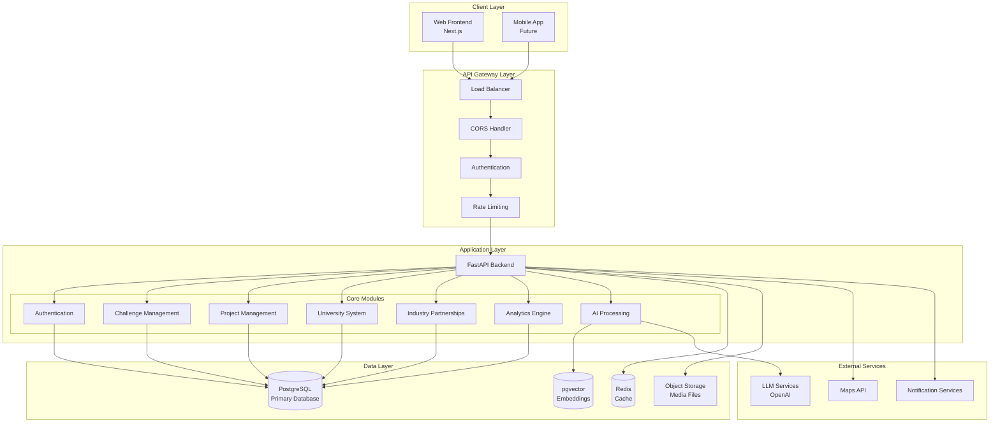

## Detailed Component Architecture

### Frontend Architecture (Next.js)

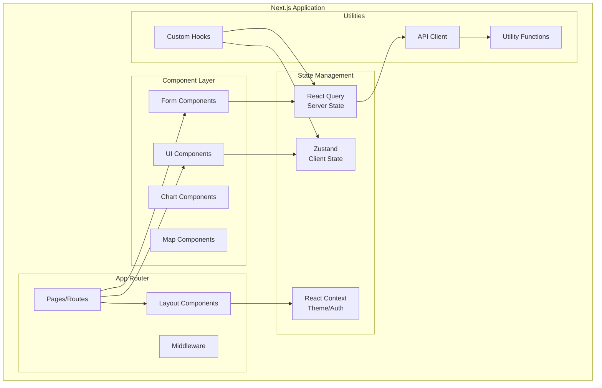

### Backend Architecture (FastAPI)

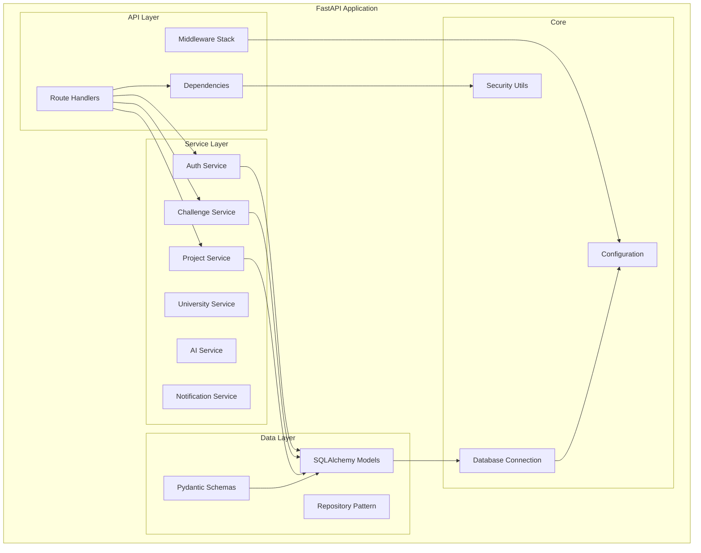

## Data Architecture

### Database Design Strategy

1. **PostgreSQL as Primary Database**
   - ACID compliance for transactional integrity
   - Rich data types and JSON support
   - Full-text search capabilities
   - Mature ecosystem and tooling

2. **pgvector Extension**
   - Vector similarity search for AI embeddings
   - Semantic matching of challenges and capabilities
   - Duplicate challenge detection

3. **Redis for Caching**
   - Session storage
   - Frequently accessed reference data
   - Rate limiting counters
   - Background job queues

### Data Flow Architecture

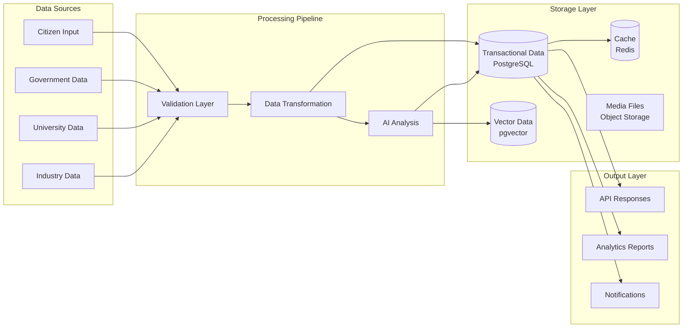

## AI Architecture

### AI Processing Pipeline

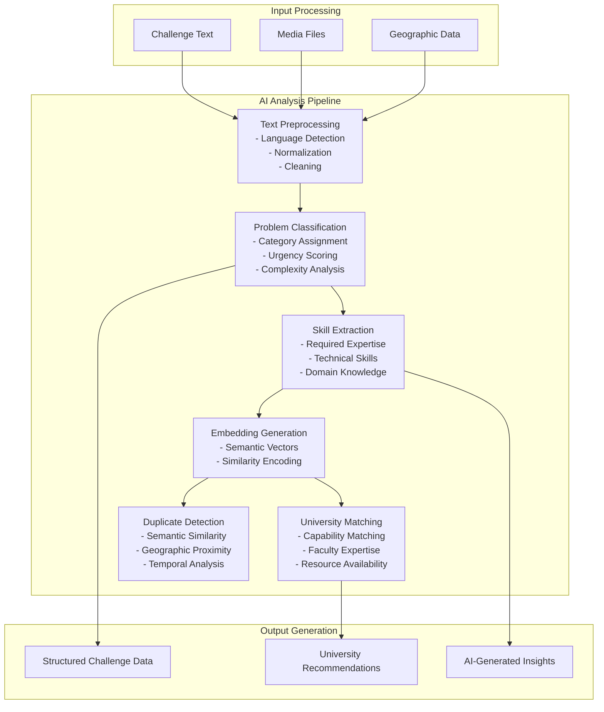

### AI Service Integration

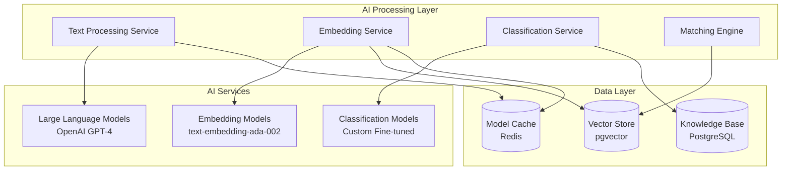

## Security Architecture

### Authentication & Authorization Flow

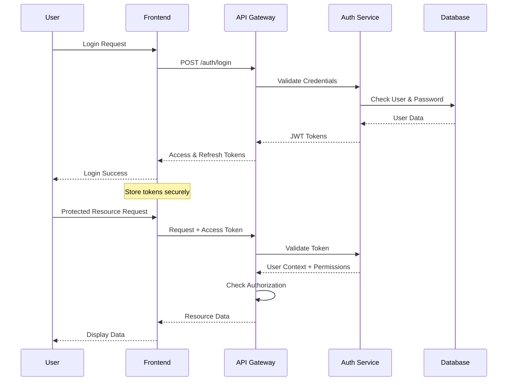

### Security Layers

1. **Network Security**
   - HTTPS everywhere with TLS 1.3
   - CORS configuration for frontend origins
   - Rate limiting per IP and user
   - DDoS protection through reverse proxy

2. **Application Security**
   - Input validation with Pydantic
   - SQL injection prevention via ORM
   - XSS protection through CSP headers
   - CSRF protection for state-changing operations

3. **Authentication Security**
   - JWT tokens with short expiration
   - Refresh token rotation
   - Password hashing with bcrypt
   - Multi-factor authentication (future)

4. **Authorization Security**
   - Role-based access control (RBAC)
   - Resource-level permissions
   - Audit logging for sensitive operations
   - Principle of least privilege

## Scalability & Performance

### Horizontal Scaling Strategy

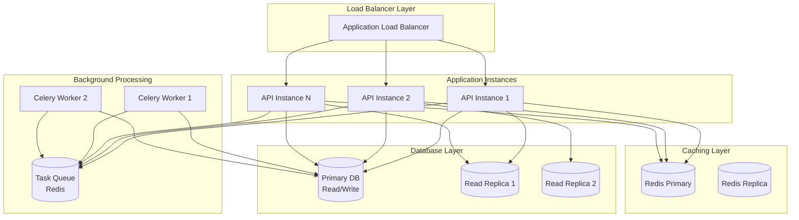

### Performance Optimization Strategies

1. **Database Optimization**
   - Query optimization with proper indexing
   - Connection pooling for efficient resource usage
   - Read replicas for query distribution
   - Materialized views for complex analytics

2. **Caching Strategy**
   - API response caching for expensive operations
   - Database query result caching
   - Static asset caching with CDN
   - Application-level caching for reference data

3. **Async Processing**
   - Background jobs for AI analysis
   - Async email and notification sending
   - Batch processing for bulk operations
   - Event-driven architecture for loose coupling

## Deployment Architecture

### Container Architecture

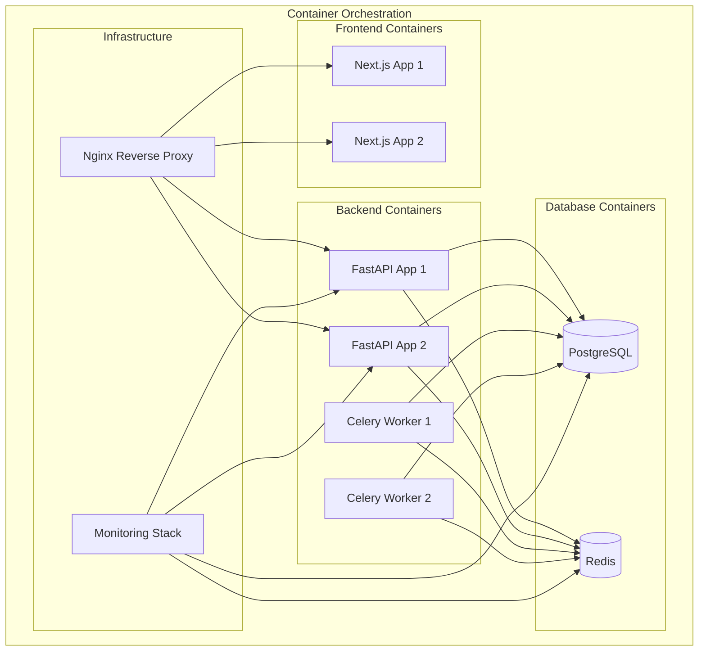

### Environment Strategy

1. **Development Environment**
   - Docker Compose for local development
   - Hot reloading for rapid iteration
   - Local database and Redis instances
   - Mock external services

2. **Staging Environment**
   - Production-like environment for testing
   - CI/CD pipeline integration
   - Performance and load testing
   - Security scanning

3. **Production Environment**
   - Kubernetes orchestration
   - Auto-scaling based on metrics
   - Multi-zone deployment for high availability
   - Comprehensive monitoring and alerting

## Integration Architecture

### External Service Integration

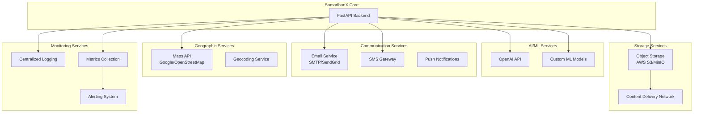

### API Integration Patterns

1. **Synchronous Integration**
   - REST API calls for real-time operations
   - Circuit breaker pattern for resilience
   - Timeout and retry mechanisms
   - Response caching where appropriate

2. **Asynchronous Integration**
   - Background job processing for heavy operations
   - Event-driven communication
   - Message queues for reliable delivery
   - Webhook support for external systems

## Monitoring & Observability

### Monitoring Stack

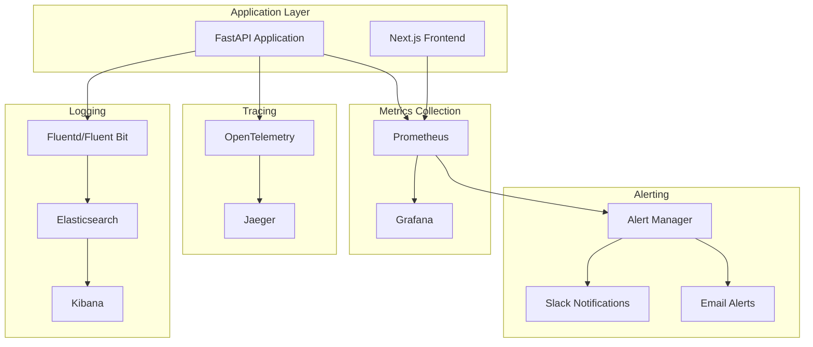

### Key Metrics & Alerts

1. **Application Metrics**
   - Request latency and throughput
   - Error rates and status codes
   - Database query performance
   - Cache hit rates

2. **Business Metrics**
   - Challenge submission rates
   - University matching success rates
   - Project completion rates
   - User engagement metrics

3. **Infrastructure Metrics**
   - CPU and memory usage
   - Disk and network I/O
   - Database connection pools
   - Queue depths

## Future Architecture Considerations

### Microservices Migration Path

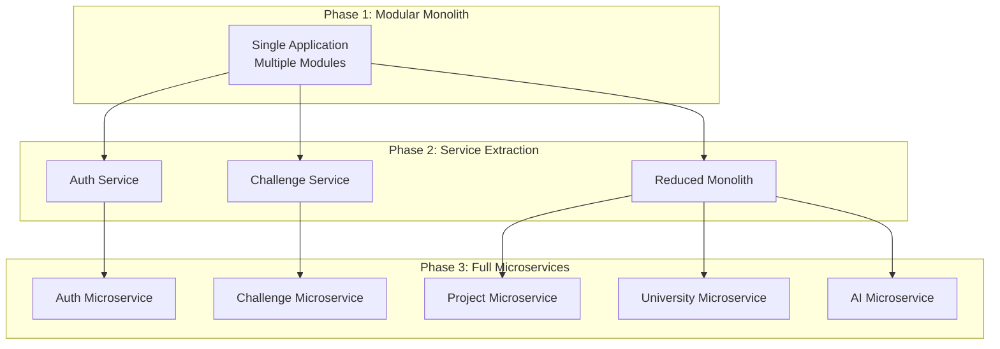

### Technology Evolution

1. **Short Term (6-12 months)**
   - Enhanced AI capabilities
   - Real-time features with WebSockets
   - Mobile application development
   - Advanced analytics and reporting

2. **Medium Term (1-2 years)**
   - Microservices extraction
   - Event-driven architecture
   - Multi-tenant capabilities
   - Advanced caching strategies

3. **Long Term (2+ years)**
   - Multi-cloud deployment
   - AI/ML model serving platform
   - Blockchain integration for transparency
   - IoT device integration

## Conclusion

The SamadhanX architecture is designed to be:

- **Scalable**: Horizontal scaling with load balancing and database replicas
- **Maintainable**: Clean separation of concerns with modular design
- **Secure**: Multi-layer security with comprehensive authentication and authorization
- **Observable**: Comprehensive monitoring and logging for operational excellence
- **Extensible**: Clear migration path to microservices as the system grows

The modular monolith approach provides the right balance between simplicity and scalability for the initial MVP while maintaining clear boundaries for future architectural evolution.