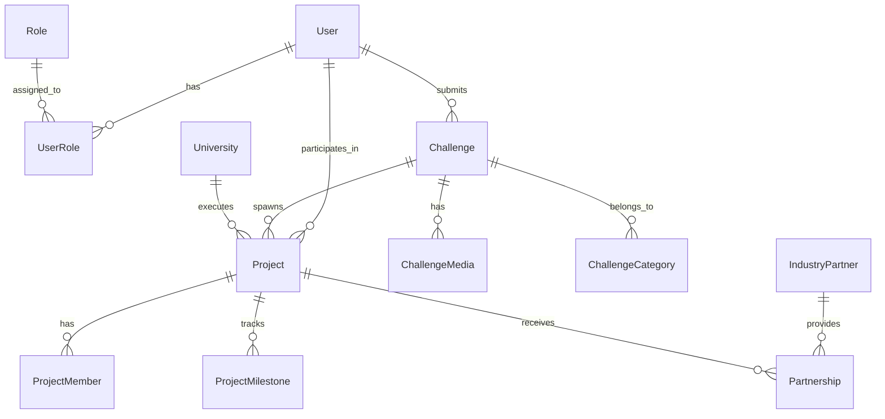

# SamadhanX Database Design

## Overview

The SamadhanX database is designed using PostgreSQL with the following principles:

- **Normalized relational design** for transactional integrity
- **UUID primary keys** for distributed system compatibility
- **Audit trails** for compliance and tracking
- **Soft deletes** for data preservation
- **Vector search** capabilities with pgvector extension
- **JSON fields** for flexible metadata storage

## Database Technology Stack

- **Primary Database**: PostgreSQL 14+
- **Vector Extension**: pgvector for semantic search
- **Connection Pooling**: SQLAlchemy with connection pooling
- **Migrations**: Alembic for schema version control
- **Backup Strategy**: WAL-based point-in-time recovery

## Entity Relationship Overview



## Core Entity Groups

### 1. User Management
### 2. Academic Institutions  
### 3. Challenge Management
### 4. Project Execution
### 5. Industry Partnerships
### 6. Analytics & Audit

## 1. User Management Schema

### users
Core user entity storing authentication and basic profile information.

```sql
CREATE TABLE users (
    id UUID PRIMARY KEY DEFAULT gen_random_uuid(),
    email VARCHAR(255) UNIQUE NOT NULL,
    password_hash VARCHAR(255) NOT NULL,
    first_name VARCHAR(100) NOT NULL,
    last_name VARCHAR(100) NOT NULL,
    phone VARCHAR(15),
    avatar_url TEXT,
    is_active BOOLEAN DEFAULT true,
    is_verified BOOLEAN DEFAULT false,
    last_login_at TIMESTAMP WITH TIME ZONE,
    created_at TIMESTAMP WITH TIME ZONE DEFAULT NOW(),
    updated_at TIMESTAMP WITH TIME ZONE DEFAULT NOW(),
    created_by UUID,
    updated_by UUID,
    is_deleted BOOLEAN DEFAULT false,
    deleted_at TIMESTAMP WITH TIME ZONE
);

CREATE INDEX idx_users_email ON users(email);
CREATE INDEX idx_users_active ON users(is_active);
CREATE INDEX idx_users_created_at ON users(created_at);
```

### roles  
System roles defining permissions and access levels.

```sql
CREATE TABLE roles (
    id UUID PRIMARY KEY DEFAULT gen_random_uuid(),
    name VARCHAR(50) UNIQUE NOT NULL,
    description TEXT,
    permissions JSONB DEFAULT '{}',
    is_active BOOLEAN DEFAULT true,
    created_at TIMESTAMP WITH TIME ZONE DEFAULT NOW(),
    updated_at TIMESTAMP WITH TIME ZONE DEFAULT NOW()
);

-- Predefined roles
INSERT INTO roles (name, description) VALUES
('CITIZEN', 'Citizens who submit challenges'),
('GOVERNMENT_OFFICER', 'Government officials who validate challenges'),
('UNIVERSITY_ADMIN', 'University administrators'),
('FACULTY', 'University faculty members'),
('STUDENT', 'University students'),
('INDUSTRY', 'Industry representatives'),
('MENTOR', 'Project mentors'),
('CSR', 'Corporate Social Responsibility managers'),
('RESEARCHER', 'Independent researchers'),
('PLATFORM_ADMIN', 'System administrators');
```
### user_roles
Many-to-many relationship between users and roles.

```sql
CREATE TABLE user_roles (
    id UUID PRIMARY KEY DEFAULT gen_random_uuid(),
    user_id UUID NOT NULL REFERENCES users(id) ON DELETE CASCADE,
    role_id UUID NOT NULL REFERENCES roles(id) ON DELETE CASCADE,
    assigned_by UUID REFERENCES users(id),
    assigned_at TIMESTAMP WITH TIME ZONE DEFAULT NOW(),
    is_active BOOLEAN DEFAULT true,
    expires_at TIMESTAMP WITH TIME ZONE,
    
    CONSTRAINT unique_user_role UNIQUE(user_id, role_id)
);

CREATE INDEX idx_user_roles_user_id ON user_roles(user_id);
CREATE INDEX idx_user_roles_role_id ON user_roles(role_id);
```

### citizens
Extended profile information for citizen users.

```sql
CREATE TABLE citizens (
    id UUID PRIMARY KEY DEFAULT gen_random_uuid(),
    user_id UUID UNIQUE NOT NULL REFERENCES users(id) ON DELETE CASCADE,
    citizen_id VARCHAR(50) UNIQUE, -- Government-issued ID
    address TEXT,
    city VARCHAR(100),
    state VARCHAR(100),
    pincode VARCHAR(10),
    occupation VARCHAR(100),
    organization VARCHAR(200),
    verification_status VARCHAR(20) DEFAULT 'PENDING',
    verification_documents JSONB DEFAULT '[]',
    created_at TIMESTAMP WITH TIME ZONE DEFAULT NOW(),
    updated_at TIMESTAMP WITH TIME ZONE DEFAULT NOW()
);

CREATE INDEX idx_citizens_user_id ON citizens(user_id);
CREATE INDEX idx_citizens_city ON citizens(city);
CREATE INDEX idx_citizens_verification_status ON citizens(verification_status);
```

### government_officers
Extended profile for government officer users.

```sql
CREATE TABLE government_officers (
    id UUID PRIMARY KEY DEFAULT gen_random_uuid(),
    user_id UUID UNIQUE NOT NULL REFERENCES users(id) ON DELETE CASCADE,
    employee_id VARCHAR(50) UNIQUE NOT NULL,
    department VARCHAR(200) NOT NULL,
    designation VARCHAR(100) NOT NULL,
    office_address TEXT,
    jurisdiction JSONB, -- Geographic or functional jurisdiction
    clearance_level VARCHAR(20) DEFAULT 'BASIC',
    is_authorized BOOLEAN DEFAULT false,
    authorization_date TIMESTAMP WITH TIME ZONE,
    created_at TIMESTAMP WITH TIME ZONE DEFAULT NOW(),
    updated_at TIMESTAMP WITH TIME ZONE DEFAULT NOW()
);

CREATE INDEX idx_government_officers_user_id ON government_officers(user_id);
CREATE INDEX idx_government_officers_department ON government_officers(department);
```
## 2. Academic Institutions Schema

### universities
Core university information and capabilities.

```sql
CREATE TABLE universities (
    id UUID PRIMARY KEY DEFAULT gen_random_uuid(),
    name VARCHAR(255) NOT NULL,
    short_name VARCHAR(50),
    description TEXT,
    address TEXT NOT NULL,
    city VARCHAR(100) NOT NULL,
    state VARCHAR(100) NOT NULL,
    pincode VARCHAR(10) NOT NULL,
    country VARCHAR(100) DEFAULT 'India',
    website VARCHAR(255),
    logo_url TEXT,
    established_year INTEGER,
    university_type VARCHAR(20) CHECK (university_type IN ('PUBLIC', 'PRIVATE', 'DEEMED')),
    accreditation JSONB DEFAULT '[]',
    rankings JSONB DEFAULT '{}',
    total_students INTEGER,
    total_faculty INTEGER,
    is_active BOOLEAN DEFAULT true,
    created_at TIMESTAMP WITH TIME ZONE DEFAULT NOW(),
    updated_at TIMESTAMP WITH TIME ZONE DEFAULT NOW()
);

CREATE INDEX idx_universities_city ON universities(city);
CREATE INDEX idx_universities_state ON universities(state);
CREATE INDEX idx_universities_type ON universities(university_type);
CREATE INDEX idx_universities_active ON universities(is_active);
```

### departments
University departments and their specializations.

```sql
CREATE TABLE departments (
    id UUID PRIMARY KEY DEFAULT gen_random_uuid(),
    university_id UUID NOT NULL REFERENCES universities(id) ON DELETE CASCADE,
    name VARCHAR(200) NOT NULL,
    short_name VARCHAR(50),
    description TEXT,
    head_of_department UUID REFERENCES users(id),
    department_type VARCHAR(50), -- Engineering, Science, Arts, etc.
    established_year INTEGER,
    student_count INTEGER DEFAULT 0,
    faculty_count INTEGER DEFAULT 0,
    research_areas JSONB DEFAULT '[]',
    facilities JSONB DEFAULT '[]',
    is_active BOOLEAN DEFAULT true,
    created_at TIMESTAMP WITH TIME ZONE DEFAULT NOW(),
    updated_at TIMESTAMP WITH TIME ZONE DEFAULT NOW(),
    
    CONSTRAINT unique_dept_per_university UNIQUE(university_id, name)
);

CREATE INDEX idx_departments_university_id ON departments(university_id);
CREATE INDEX idx_departments_type ON departments(department_type);
```
### faculty
Faculty member profiles with expertise and availability.

```sql
CREATE TABLE faculty (
    id UUID PRIMARY KEY DEFAULT gen_random_uuid(),
    user_id UUID UNIQUE NOT NULL REFERENCES users(id) ON DELETE CASCADE,
    university_id UUID NOT NULL REFERENCES universities(id) ON DELETE CASCADE,
    department_id UUID NOT NULL REFERENCES departments(id) ON DELETE CASCADE,
    employee_id VARCHAR(50) NOT NULL,
    designation VARCHAR(100) NOT NULL,
    qualification JSONB DEFAULT '[]', -- Degrees and certifications
    experience_years INTEGER DEFAULT 0,
    research_interests JSONB DEFAULT '[]',
    expertise_areas JSONB DEFAULT '[]',
    publications JSONB DEFAULT '[]',
    projects_supervised INTEGER DEFAULT 0,
    current_projects INTEGER DEFAULT 0,
    max_projects INTEGER DEFAULT 3,
    is_available BOOLEAN DEFAULT true,
    office_location VARCHAR(100),
    office_hours VARCHAR(200),
    created_at TIMESTAMP WITH TIME ZONE DEFAULT NOW(),
    updated_at TIMESTAMP WITH TIME ZONE DEFAULT NOW(),
    
    CONSTRAINT unique_faculty_employee_id UNIQUE(university_id, employee_id)
);

CREATE INDEX idx_faculty_user_id ON faculty(user_id);
CREATE INDEX idx_faculty_university_id ON faculty(university_id);
CREATE INDEX idx_faculty_department_id ON faculty(department_id);
CREATE INDEX idx_faculty_available ON faculty(is_available);
```

### students
Student profiles with skills and interests.

```sql
CREATE TABLE students (
    id UUID PRIMARY KEY DEFAULT gen_random_uuid(),
    user_id UUID UNIQUE NOT NULL REFERENCES users(id) ON DELETE CASCADE,
    university_id UUID NOT NULL REFERENCES universities(id) ON DELETE CASCADE,
    department_id UUID NOT NULL REFERENCES departments(id) ON DELETE CASCADE,
    student_id VARCHAR(50) NOT NULL,
    program VARCHAR(100) NOT NULL, -- B.Tech, M.Tech, PhD, etc.
    year_of_study INTEGER NOT NULL,
    expected_graduation DATE,
    cgpa DECIMAL(3,2),
    skills JSONB DEFAULT '[]',
    interests JSONB DEFAULT '[]',
    certifications JSONB DEFAULT '[]',
    current_projects INTEGER DEFAULT 0,
    max_projects INTEGER DEFAULT 2,
    is_available BOOLEAN DEFAULT true,
    created_at TIMESTAMP WITH TIME ZONE DEFAULT NOW(),
    updated_at TIMESTAMP WITH TIME ZONE DEFAULT NOW(),
    
    CONSTRAINT unique_student_id UNIQUE(university_id, student_id)
);

CREATE INDEX idx_students_user_id ON students(user_id);
CREATE INDEX idx_students_university_id ON students(university_id);
CREATE INDEX idx_students_department_id ON students(department_id);
CREATE INDEX idx_students_program ON students(program);
CREATE INDEX idx_students_available ON students(is_available);
```
### expertise
Standardized expertise areas and skills taxonomy.

```sql
CREATE TABLE expertise (
    id UUID PRIMARY KEY DEFAULT gen_random_uuid(),
    name VARCHAR(200) NOT NULL UNIQUE,
    category VARCHAR(100) NOT NULL,
    subcategory VARCHAR(100),
    description TEXT,
    keywords JSONB DEFAULT '[]',
    parent_id UUID REFERENCES expertise(id),
    level INTEGER DEFAULT 1, -- Hierarchy level
    is_active BOOLEAN DEFAULT true,
    created_at TIMESTAMP WITH TIME ZONE DEFAULT NOW()
);

CREATE INDEX idx_expertise_category ON expertise(category);
CREATE INDEX idx_expertise_parent_id ON expertise(parent_id);
```

### university_expertise
University-level expertise and capabilities.

```sql
CREATE TABLE university_expertise (
    id UUID PRIMARY KEY DEFAULT gen_random_uuid(),
    university_id UUID NOT NULL REFERENCES universities(id) ON DELETE CASCADE,
    expertise_id UUID NOT NULL REFERENCES expertise(id) ON DELETE CASCADE,
    proficiency_level VARCHAR(20) DEFAULT 'INTERMEDIATE', -- BASIC, INTERMEDIATE, ADVANCED, EXPERT
    faculty_count INTEGER DEFAULT 0,
    recent_projects INTEGER DEFAULT 0,
    facilities_available JSONB DEFAULT '[]',
    created_at TIMESTAMP WITH TIME ZONE DEFAULT NOW(),
    
    CONSTRAINT unique_university_expertise UNIQUE(university_id, expertise_id)
);

CREATE INDEX idx_university_expertise_university_id ON university_expertise(university_id);
CREATE INDEX idx_university_expertise_expertise_id ON university_expertise(expertise_id);
```

### faculty_expertise
Individual faculty expertise mapping.

```sql
CREATE TABLE faculty_expertise (
    id UUID PRIMARY KEY DEFAULT gen_random_uuid(),
    faculty_id UUID NOT NULL REFERENCES faculty(id) ON DELETE CASCADE,
    expertise_id UUID NOT NULL REFERENCES expertise(id) ON DELETE CASCADE,
    proficiency_level VARCHAR(20) DEFAULT 'INTERMEDIATE',
    years_of_experience INTEGER DEFAULT 0,
    is_primary BOOLEAN DEFAULT false, -- Primary area of expertise
    created_at TIMESTAMP WITH TIME ZONE DEFAULT NOW(),
    
    CONSTRAINT unique_faculty_expertise UNIQUE(faculty_id, expertise_id)
);

CREATE INDEX idx_faculty_expertise_faculty_id ON faculty_expertise(faculty_id);
CREATE INDEX idx_faculty_expertise_expertise_id ON faculty_expertise(expertise_id);
```
## 3. Challenge Management Schema

### categories
Hierarchical categorization system for challenges.

```sql
CREATE TABLE categories (
    id UUID PRIMARY KEY DEFAULT gen_random_uuid(),
    name VARCHAR(200) NOT NULL,
    description TEXT,
    parent_id UUID REFERENCES categories(id),
    level INTEGER DEFAULT 1,
    color_code VARCHAR(7), -- Hex color for UI
    icon VARCHAR(50), -- Icon identifier
    keywords JSONB DEFAULT '[]',
    is_active BOOLEAN DEFAULT true,
    created_at TIMESTAMP WITH TIME ZONE DEFAULT NOW(),
    updated_at TIMESTAMP WITH TIME ZONE DEFAULT NOW()
);

CREATE INDEX idx_categories_parent_id ON categories(parent_id);
CREATE INDEX idx_categories_level ON categories(level);
CREATE INDEX idx_categories_active ON categories(is_active);
```

### challenges
Core challenge entity with lifecycle management.

```sql
CREATE TABLE challenges (
    id UUID PRIMARY KEY DEFAULT gen_random_uuid(),
    title VARCHAR(500) NOT NULL,
    description TEXT NOT NULL,
    status VARCHAR(30) DEFAULT 'DRAFT' CHECK (status IN (
        'DRAFT', 'SUBMITTED', 'AI_ANALYSIS', 'PENDING_REVIEW',
        'VALIDATED', 'MATCHING', 'UNIVERSITY_INVITED', 'ACCEPTED',
        'PROJECT_CREATED', 'REJECTED', 'DUPLICATE', 'ON_HOLD', 'CANCELLED'
    )),
    priority VARCHAR(20) DEFAULT 'MEDIUM' CHECK (priority IN ('LOW', 'MEDIUM', 'HIGH', 'CRITICAL')),
    
    -- Location information
    location_description TEXT NOT NULL,
    city VARCHAR(100),
    state VARCHAR(100),
    pincode VARCHAR(10),
    latitude DECIMAL(10, 8),
    longitude DECIMAL(11, 8),
    
    -- Submission details
    submitted_by UUID NOT NULL REFERENCES users(id),
    submission_date TIMESTAMP WITH TIME ZONE,
    
    -- Assignment and review
    assigned_to UUID REFERENCES users(id), -- Government officer
    assigned_at TIMESTAMP WITH TIME ZONE,
    reviewed_by UUID REFERENCES users(id),
    reviewed_at TIMESTAMP WITH TIME ZONE,
    review_notes TEXT,
    
    -- Metadata
    estimated_impact VARCHAR(20), -- LOCAL, REGIONAL, STATE, NATIONAL
    affected_population INTEGER,
    urgency_score DECIMAL(3, 2), -- 0.00 to 10.00
    complexity_score DECIMAL(3, 2), -- 0.00 to 10.00
    
    -- Lifecycle timestamps
    created_at TIMESTAMP WITH TIME ZONE DEFAULT NOW(),
    updated_at TIMESTAMP WITH TIME ZONE DEFAULT NOW(),
    created_by UUID REFERENCES users(id),
    updated_by UUID REFERENCES users(id),
    is_deleted BOOLEAN DEFAULT false,
    deleted_at TIMESTAMP WITH TIME ZONE
);

CREATE INDEX idx_challenges_status ON challenges(status);
CREATE INDEX idx_challenges_priority ON challenges(priority);
CREATE INDEX idx_challenges_submitted_by ON challenges(submitted_by);
CREATE INDEX idx_challenges_assigned_to ON challenges(assigned_to);
CREATE INDEX idx_challenges_location ON challenges(city, state);
CREATE INDEX idx_challenges_submission_date ON challenges(submission_date);
CREATE INDEX idx_challenges_created_at ON challenges(created_at);
```
### challenge_categories
Many-to-many relationship between challenges and categories.

```sql
CREATE TABLE challenge_categories (
    id UUID PRIMARY KEY DEFAULT gen_random_uuid(),
    challenge_id UUID NOT NULL REFERENCES challenges(id) ON DELETE CASCADE,
    category_id UUID NOT NULL REFERENCES categories(id) ON DELETE CASCADE,
    relevance_score DECIMAL(3, 2) DEFAULT 1.00, -- AI-assigned relevance
    created_at TIMESTAMP WITH TIME ZONE DEFAULT NOW(),
    
    CONSTRAINT unique_challenge_category UNIQUE(challenge_id, category_id)
);

CREATE INDEX idx_challenge_categories_challenge_id ON challenge_categories(challenge_id);
CREATE INDEX idx_challenge_categories_category_id ON challenge_categories(category_id);
```

### challenge_media
Media files associated with challenges.

```sql
CREATE TABLE challenge_media (
    id UUID PRIMARY KEY DEFAULT gen_random_uuid(),
    challenge_id UUID NOT NULL REFERENCES challenges(id) ON DELETE CASCADE,
    filename VARCHAR(255) NOT NULL,
    original_name VARCHAR(255) NOT NULL,
    file_size BIGINT NOT NULL,
    mime_type VARCHAR(100) NOT NULL,
    file_url TEXT NOT NULL,
    thumbnail_url TEXT,
    media_type VARCHAR(20) CHECK (media_type IN ('IMAGE', 'VIDEO', 'DOCUMENT', 'AUDIO')),
    description TEXT,
    uploaded_by UUID NOT NULL REFERENCES users(id),
    uploaded_at TIMESTAMP WITH TIME ZONE DEFAULT NOW(),
    is_public BOOLEAN DEFAULT true,
    
    CONSTRAINT valid_file_size CHECK (file_size > 0 AND file_size <= 10485760) -- 10MB max
);

CREATE INDEX idx_challenge_media_challenge_id ON challenge_media(challenge_id);
CREATE INDEX idx_challenge_media_type ON challenge_media(media_type);
CREATE INDEX idx_challenge_media_uploaded_by ON challenge_media(uploaded_by);
```

### challenge_ai_analysis
AI-generated analysis and insights for challenges.

```sql
CREATE TABLE challenge_ai_analysis (
    id UUID PRIMARY KEY DEFAULT gen_random_uuid(),
    challenge_id UUID UNIQUE NOT NULL REFERENCES challenges(id) ON DELETE CASCADE,
    
    -- Classification results
    primary_category VARCHAR(200),
    secondary_categories JSONB DEFAULT '[]',
    confidence_score DECIMAL(3, 2), -- 0.00 to 1.00
    
    -- Extracted information
    required_skills JSONB DEFAULT '[]',
    estimated_timeline VARCHAR(100),
    estimated_budget_range VARCHAR(100),
    complexity_factors JSONB DEFAULT '[]',
    
    -- Scoring
    urgency_score DECIMAL(3, 2),
    impact_score DECIMAL(3, 2),
    feasibility_score DECIMAL(3, 2),
    innovation_score DECIMAL(3, 2),
    
    -- Analysis metadata
    model_version VARCHAR(50),
    processing_time INTERVAL,
    analysis_date TIMESTAMP WITH TIME ZONE DEFAULT NOW(),
    
    -- Raw AI responses
    raw_analysis JSONB DEFAULT '{}',
    
    created_at TIMESTAMP WITH TIME ZONE DEFAULT NOW()
);

CREATE INDEX idx_challenge_ai_analysis_challenge_id ON challenge_ai_analysis(challenge_id);
CREATE INDEX idx_challenge_ai_analysis_primary_category ON challenge_ai_analysis(primary_category);
```
### challenge_embeddings
Vector embeddings for semantic search and similarity.

```sql
-- Requires pgvector extension
CREATE EXTENSION IF NOT EXISTS vector;

CREATE TABLE challenge_embeddings (
    id UUID PRIMARY KEY DEFAULT gen_random_uuid(),
    challenge_id UUID UNIQUE NOT NULL REFERENCES challenges(id) ON DELETE CASCADE,
    title_embedding vector(1536), -- OpenAI ada-002 dimension
    description_embedding vector(1536),
    combined_embedding vector(1536), -- Title + description combined
    embedding_model VARCHAR(100) DEFAULT 'text-embedding-ada-002',
    embedding_version VARCHAR(20) DEFAULT '1.0',
    created_at TIMESTAMP WITH TIME ZONE DEFAULT NOW(),
    updated_at TIMESTAMP WITH TIME ZONE DEFAULT NOW()
);

-- Vector similarity indexes
CREATE INDEX idx_challenge_embeddings_title_cosine 
    ON challenge_embeddings 
    USING ivfflat (title_embedding vector_cosine_ops);

CREATE INDEX idx_challenge_embeddings_description_cosine 
    ON challenge_embeddings 
    USING ivfflat (description_embedding vector_cosine_ops);

CREATE INDEX idx_challenge_embeddings_combined_cosine 
    ON challenge_embeddings 
    USING ivfflat (combined_embedding vector_cosine_ops);
```

### challenge_duplicates
Duplicate detection results and relationships.

```sql
CREATE TABLE challenge_duplicates (
    id UUID PRIMARY KEY DEFAULT gen_random_uuid(),
    original_challenge_id UUID NOT NULL REFERENCES challenges(id) ON DELETE CASCADE,
    duplicate_challenge_id UUID NOT NULL REFERENCES challenges(id) ON DELETE CASCADE,
    similarity_score DECIMAL(3, 2) NOT NULL, -- 0.00 to 1.00
    similarity_type VARCHAR(50) NOT NULL, -- SEMANTIC, GEOGRAPHIC, TEMPORAL
    detection_method VARCHAR(50) NOT NULL, -- AI_EMBEDDING, MANUAL, RULE_BASED
    detected_by UUID REFERENCES users(id),
    detected_at TIMESTAMP WITH TIME ZONE DEFAULT NOW(),
    is_confirmed BOOLEAN DEFAULT false,
    confirmed_by UUID REFERENCES users(id),
    confirmed_at TIMESTAMP WITH TIME ZONE,
    notes TEXT,
    
    CONSTRAINT unique_duplicate_pair UNIQUE(original_challenge_id, duplicate_challenge_id),
    CONSTRAINT no_self_duplicate CHECK (original_challenge_id != duplicate_challenge_id)
);

CREATE INDEX idx_challenge_duplicates_original ON challenge_duplicates(original_challenge_id);
CREATE INDEX idx_challenge_duplicates_duplicate ON challenge_duplicates(duplicate_challenge_id);
CREATE INDEX idx_challenge_duplicates_similarity_score ON challenge_duplicates(similarity_score);
```

### challenge_assignments
University assignments and matching results.

```sql
CREATE TABLE challenge_assignments (
    id UUID PRIMARY KEY DEFAULT gen_random_uuid(),
    challenge_id UUID NOT NULL REFERENCES challenges(id) ON DELETE CASCADE,
    university_id UUID NOT NULL REFERENCES universities(id) ON DELETE CASCADE,
    
    -- Assignment details
    assignment_type VARCHAR(30) DEFAULT 'INVITATION' CHECK (assignment_type IN 
        ('AI_MATCH', 'MANUAL_ASSIGNMENT', 'INVITATION', 'SELF_SELECTION')),
    status VARCHAR(30) DEFAULT 'PENDING' CHECK (status IN 
        ('PENDING', 'ACCEPTED', 'DECLINED', 'EXPIRED', 'WITHDRAWN')),
    
    -- Matching information
    match_score DECIMAL(3, 2), -- 0.00 to 1.00 for AI matches
    match_reasons JSONB DEFAULT '[]',
    matching_faculty JSONB DEFAULT '[]', -- Faculty UUIDs
    matching_capabilities JSONB DEFAULT '[]', -- Expertise areas
    
    -- Timeline
    assigned_by UUID REFERENCES users(id),
    assigned_at TIMESTAMP WITH TIME ZONE DEFAULT NOW(),
    response_deadline TIMESTAMP WITH TIME ZONE,
    responded_by UUID REFERENCES users(id),
    responded_at TIMESTAMP WITH TIME ZONE,
    
    -- Notes and communication
    assignment_notes TEXT,
    response_notes TEXT,
    
    CONSTRAINT unique_challenge_university_assignment UNIQUE(challenge_id, university_id)
);

CREATE INDEX idx_challenge_assignments_challenge_id ON challenge_assignments(challenge_id);
CREATE INDEX idx_challenge_assignments_university_id ON challenge_assignments(university_id);
CREATE INDEX idx_challenge_assignments_status ON challenge_assignments(status);
```
## 4. Project Execution Schema

### projects
University-led projects addressing challenges.

```sql
CREATE TABLE projects (
    id UUID PRIMARY KEY DEFAULT gen_random_uuid(),
    title VARCHAR(500) NOT NULL,
    description TEXT NOT NULL,
    
    -- Relationships
    challenge_id UUID NOT NULL REFERENCES challenges(id),
    university_id UUID NOT NULL REFERENCES universities(id),
    department_id UUID REFERENCES departments(id),
    
    -- Project details
    status VARCHAR(30) DEFAULT 'DRAFT' CHECK (status IN (
        'DRAFT', 'TEAM_FORMED', 'PROPOSAL_SUBMITTED', 'APPROVED',
        'PROTOTYPE', 'TESTING', 'PILOT', 'DEPLOYED',
        'IMPACT_MEASURED', 'COMPLETED', 'SUSPENDED', 'CANCELLED'
    )),
    project_type VARCHAR(50) DEFAULT 'RESEARCH', -- RESEARCH, DEVELOPMENT, INNOVATION
    
    -- Timeline
    start_date DATE,
    expected_end_date DATE,
    actual_end_date DATE,
    
    -- Budget and resources
    estimated_budget DECIMAL(12, 2),
    approved_budget DECIMAL(12, 2),
    actual_spent DECIMAL(12, 2),
    funding_source VARCHAR(200),
    
    -- Team structure
    team_lead UUID REFERENCES users(id),
    faculty_advisor UUID REFERENCES faculty(id),
    team_size INTEGER DEFAULT 0,
    
    -- Progress tracking
    completion_percentage DECIMAL(5, 2) DEFAULT 0.00,
    last_milestone_completed UUID,
    next_milestone_due DATE,
    
    -- Metadata
    tags JSONB DEFAULT '[]',
    methodology TEXT,
    expected_outcomes TEXT,
    success_metrics JSONB DEFAULT '[]',
    
    -- Lifecycle tracking
    created_at TIMESTAMP WITH TIME ZONE DEFAULT NOW(),
    updated_at TIMESTAMP WITH TIME ZONE DEFAULT NOW(),
    created_by UUID REFERENCES users(id),
    updated_by UUID REFERENCES users(id),
    is_deleted BOOLEAN DEFAULT false,
    deleted_at TIMESTAMP WITH TIME ZONE
);

CREATE INDEX idx_projects_challenge_id ON projects(challenge_id);
CREATE INDEX idx_projects_university_id ON projects(university_id);
CREATE INDEX idx_projects_status ON projects(status);
CREATE INDEX idx_projects_team_lead ON projects(team_lead);
CREATE INDEX idx_projects_start_date ON projects(start_date);
```

### project_members
Team composition and role assignments.

```sql
CREATE TABLE project_members (
    id UUID PRIMARY KEY DEFAULT gen_random_uuid(),
    project_id UUID NOT NULL REFERENCES projects(id) ON DELETE CASCADE,
    user_id UUID NOT NULL REFERENCES users(id) ON DELETE CASCADE,
    
    -- Role and responsibilities
    role VARCHAR(50) NOT NULL, -- LEAD, CO_LEAD, MEMBER, ADVISOR, MENTOR
    responsibilities TEXT,
    expertise_contribution JSONB DEFAULT '[]',
    
    -- Participation details
    joined_at TIMESTAMP WITH TIME ZONE DEFAULT NOW(),
    left_at TIMESTAMP WITH TIME ZONE,
    is_active BOOLEAN DEFAULT true,
    
    -- Time commitment
    hours_per_week INTEGER,
    total_hours_contributed INTEGER DEFAULT 0,
    
    -- Performance and contribution
    performance_rating DECIMAL(2, 1), -- 1.0 to 5.0
    contribution_notes TEXT,
    
    CONSTRAINT unique_project_member UNIQUE(project_id, user_id)
);

CREATE INDEX idx_project_members_project_id ON project_members(project_id);
CREATE INDEX idx_project_members_user_id ON project_members(user_id);
CREATE INDEX idx_project_members_role ON project_members(role);
CREATE INDEX idx_project_members_active ON project_members(is_active);
```
### project_milestones
Project milestone tracking and progress management.

```sql
CREATE TABLE project_milestones (
    id UUID PRIMARY KEY DEFAULT gen_random_uuid(),
    project_id UUID NOT NULL REFERENCES projects(id) ON DELETE CASCADE,
    title VARCHAR(300) NOT NULL,
    description TEXT,
    
    -- Timeline
    planned_start_date DATE NOT NULL,
    planned_end_date DATE NOT NULL,
    actual_start_date DATE,
    actual_end_date DATE,
    
    -- Status and progress
    status VARCHAR(30) DEFAULT 'PENDING' CHECK (status IN 
        ('PENDING', 'IN_PROGRESS', 'COMPLETED', 'OVERDUE', 'CANCELLED')),
    completion_percentage DECIMAL(5, 2) DEFAULT 0.00,
    
    -- Priority and dependencies
    priority VARCHAR(20) DEFAULT 'MEDIUM' CHECK (priority IN ('LOW', 'MEDIUM', 'HIGH', 'CRITICAL')),
    order_sequence INTEGER NOT NULL,
    dependencies JSONB DEFAULT '[]', -- Other milestone IDs
    
    -- Deliverables and outcomes
    expected_deliverables JSONB DEFAULT '[]',
    success_criteria TEXT,
    
    -- Assignment and tracking
    assigned_to JSONB DEFAULT '[]', -- User IDs responsible
    created_by UUID REFERENCES users(id),
    updated_by UUID REFERENCES users(id),
    
    created_at TIMESTAMP WITH TIME ZONE DEFAULT NOW(),
    updated_at TIMESTAMP WITH TIME ZONE DEFAULT NOW()
);

CREATE INDEX idx_project_milestones_project_id ON project_milestones(project_id);
CREATE INDEX idx_project_milestones_status ON project_milestones(status);
CREATE INDEX idx_project_milestones_planned_end_date ON project_milestones(planned_end_date);
CREATE INDEX idx_project_milestones_order_sequence ON project_milestones(project_id, order_sequence);
```

### project_deliverables
Outputs and deliverables from project milestones.

```sql
CREATE TABLE project_deliverables (
    id UUID PRIMARY KEY DEFAULT gen_random_uuid(),
    project_id UUID NOT NULL REFERENCES projects(id) ON DELETE CASCADE,
    milestone_id UUID REFERENCES project_milestones(id),
    
    -- Deliverable details
    title VARCHAR(300) NOT NULL,
    description TEXT,
    deliverable_type VARCHAR(50) NOT NULL, -- DOCUMENT, PROTOTYPE, CODE, REPORT, DEMO
    
    -- File and content
    file_url TEXT,
    file_size BIGINT,
    mime_type VARCHAR(100),
    version_number VARCHAR(20) DEFAULT '1.0',
    
    -- Submission details
    submitted_by UUID NOT NULL REFERENCES users(id),
    submitted_at TIMESTAMP WITH TIME ZONE DEFAULT NOW(),
    
    -- Review and approval
    status VARCHAR(30) DEFAULT 'SUBMITTED' CHECK (status IN 
        ('DRAFT', 'SUBMITTED', 'UNDER_REVIEW', 'APPROVED', 'REJECTED', 'NEEDS_REVISION')),
    reviewed_by UUID REFERENCES users(id),
    reviewed_at TIMESTAMP WITH TIME ZONE,
    review_notes TEXT,
    approval_date TIMESTAMP WITH TIME ZONE,
    
    -- Metadata
    tags JSONB DEFAULT '[]',
    is_public BOOLEAN DEFAULT false,
    
    created_at TIMESTAMP WITH TIME ZONE DEFAULT NOW(),
    updated_at TIMESTAMP WITH TIME ZONE DEFAULT NOW()
);

CREATE INDEX idx_project_deliverables_project_id ON project_deliverables(project_id);
CREATE INDEX idx_project_deliverables_milestone_id ON project_deliverables(milestone_id);
CREATE INDEX idx_project_deliverables_type ON project_deliverables(deliverable_type);
CREATE INDEX idx_project_deliverables_status ON project_deliverables(status);
```

### project_proposals
Detailed project proposals for approval.

```sql
CREATE TABLE project_proposals (
    id UUID PRIMARY KEY DEFAULT gen_random_uuid(),
    project_id UUID UNIQUE NOT NULL REFERENCES projects(id) ON DELETE CASCADE,
    
    -- Proposal content
    executive_summary TEXT NOT NULL,
    problem_statement TEXT NOT NULL,
    proposed_solution TEXT NOT NULL,
    methodology TEXT NOT NULL,
    timeline TEXT NOT NULL,
    budget_breakdown JSONB NOT NULL,
    expected_outcomes TEXT NOT NULL,
    risk_assessment TEXT,
    sustainability_plan TEXT,
    
    -- Submission and review
    version_number VARCHAR(20) DEFAULT '1.0',
    submitted_by UUID NOT NULL REFERENCES users(id),
    submitted_at TIMESTAMP WITH TIME ZONE DEFAULT NOW(),
    
    -- Approval workflow
    status VARCHAR(30) DEFAULT 'DRAFT' CHECK (status IN 
        ('DRAFT', 'SUBMITTED', 'UNDER_REVIEW', 'APPROVED', 'REJECTED', 'NEEDS_REVISION')),
    reviewed_by UUID REFERENCES users(id),
    reviewed_at TIMESTAMP WITH TIME ZONE,
    review_comments TEXT,
    approved_by UUID REFERENCES users(id),
    approved_at TIMESTAMP WITH TIME ZONE,
    
    created_at TIMESTAMP WITH TIME ZONE DEFAULT NOW(),
    updated_at TIMESTAMP WITH TIME ZONE DEFAULT NOW()
);

CREATE INDEX idx_project_proposals_project_id ON project_proposals(project_id);
CREATE INDEX idx_project_proposals_status ON project_proposals(status);
CREATE INDEX idx_project_proposals_submitted_by ON project_proposals(submitted_by);
```
## 5. Industry Partnerships Schema

### industry_partners
Corporate and industry organization profiles.

```sql
CREATE TABLE industry_partners (
    id UUID PRIMARY KEY DEFAULT gen_random_uuid(),
    name VARCHAR(255) NOT NULL,
    description TEXT,
    industry_type VARCHAR(100) NOT NULL, -- IT, Manufacturing, Healthcare, etc.
    company_size VARCHAR(20), -- STARTUP, SME, LARGE, MNC
    
    -- Contact information
    website VARCHAR(255),
    logo_url TEXT,
    headquarters_address TEXT,
    contact_person VARCHAR(200),
    contact_email VARCHAR(255),
    contact_phone VARCHAR(15),
    
    -- Business details
    established_year INTEGER,
    annual_revenue_range VARCHAR(50),
    employee_count_range VARCHAR(50),
    
    -- Collaboration areas
    expertise_areas JSONB DEFAULT '[]',
    csr_focus_areas JSONB DEFAULT '[]',
    collaboration_types JSONB DEFAULT '[]', -- FUNDING, MENTORSHIP, RESOURCES, DEPLOYMENT
    
    -- Partnership preferences
    preferred_project_types JSONB DEFAULT '[]',
    geographic_preference JSONB DEFAULT '[]',
    budget_range_min DECIMAL(12, 2),
    budget_range_max DECIMAL(12, 2),
    
    -- Status and verification
    is_verified BOOLEAN DEFAULT false,
    verification_documents JSONB DEFAULT '[]',
    is_active BOOLEAN DEFAULT true,
    
    created_at TIMESTAMP WITH TIME ZONE DEFAULT NOW(),
    updated_at TIMESTAMP WITH TIME ZONE DEFAULT NOW()
);

CREATE INDEX idx_industry_partners_industry_type ON industry_partners(industry_type);
CREATE INDEX idx_industry_partners_company_size ON industry_partners(company_size);
CREATE INDEX idx_industry_partners_verified ON industry_partners(is_verified);
CREATE INDEX idx_industry_partners_active ON industry_partners(is_active);
```

### industry_expertise
Industry partner expertise and capability mapping.

```sql
CREATE TABLE industry_expertise (
    id UUID PRIMARY KEY DEFAULT gen_random_uuid(),
    industry_partner_id UUID NOT NULL REFERENCES industry_partners(id) ON DELETE CASCADE,
    expertise_id UUID NOT NULL REFERENCES expertise(id) ON DELETE CASCADE,
    proficiency_level VARCHAR(20) DEFAULT 'INTERMEDIATE',
    years_of_experience INTEGER DEFAULT 0,
    is_core_competency BOOLEAN DEFAULT false,
    created_at TIMESTAMP WITH TIME ZONE DEFAULT NOW(),
    
    CONSTRAINT unique_industry_expertise UNIQUE(industry_partner_id, expertise_id)
);

CREATE INDEX idx_industry_expertise_partner_id ON industry_expertise(industry_partner_id);
CREATE INDEX idx_industry_expertise_expertise_id ON industry_expertise(expertise_id);
```

### partnerships
Partnership agreements between projects and industry.

```sql
CREATE TABLE partnerships (
    id UUID PRIMARY KEY DEFAULT gen_random_uuid(),
    project_id UUID NOT NULL REFERENCES projects(id) ON DELETE CASCADE,
    industry_partner_id UUID NOT NULL REFERENCES industry_partners(id) ON DELETE CASCADE,
    
    -- Partnership details
    partnership_type VARCHAR(50) NOT NULL, -- FUNDING, MENTORSHIP, RESOURCES, DEPLOYMENT, HYBRID
    title VARCHAR(300) NOT NULL,
    description TEXT,
    
    -- Timeline
    start_date DATE NOT NULL,
    end_date DATE,
    actual_end_date DATE,
    
    -- Status and terms
    status VARCHAR(30) DEFAULT 'PROPOSED' CHECK (status IN 
        ('PROPOSED', 'NEGOTIATING', 'ACTIVE', 'COMPLETED', 'TERMINATED', 'SUSPENDED')),
    
    -- Financial terms
    total_value DECIMAL(12, 2),
    payment_schedule JSONB DEFAULT '[]',
    currency VARCHAR(3) DEFAULT 'INR',
    
    -- Deliverables and obligations
    industry_obligations JSONB DEFAULT '[]',
    university_obligations JSONB DEFAULT '[]',
    shared_obligations JSONB DEFAULT '[]',
    
    -- Intellectual Property
    ip_terms TEXT,
    publication_rights TEXT,
    commercialization_terms TEXT,
    
    -- Agreement details
    agreement_document_url TEXT,
    signed_by_industry UUID REFERENCES users(id),
    signed_by_university UUID REFERENCES users(id),
    industry_signature_date DATE,
    university_signature_date DATE,
    
    created_at TIMESTAMP WITH TIME ZONE DEFAULT NOW(),
    updated_at TIMESTAMP WITH TIME ZONE DEFAULT NOW(),
    created_by UUID REFERENCES users(id)
);

CREATE INDEX idx_partnerships_project_id ON partnerships(project_id);
CREATE INDEX idx_partnerships_industry_partner_id ON partnerships(industry_partner_id);
CREATE INDEX idx_partnerships_status ON partnerships(status);
CREATE INDEX idx_partnerships_type ON partnerships(partnership_type);
```
### funding
Funding tracking and disbursement.

```sql
CREATE TABLE funding (
    id UUID PRIMARY KEY DEFAULT gen_random_uuid(),
    partnership_id UUID NOT NULL REFERENCES partnerships(id) ON DELETE CASCADE,
    project_id UUID NOT NULL REFERENCES projects(id) ON DELETE CASCADE,
    
    -- Funding details
    funding_type VARCHAR(50) NOT NULL, -- GRANT, SPONSORSHIP, INVESTMENT, CSR
    amount DECIMAL(12, 2) NOT NULL,
    currency VARCHAR(3) DEFAULT 'INR',
    
    -- Timeline
    approved_date DATE,
    disbursement_schedule JSONB DEFAULT '[]',
    
    -- Status tracking
    status VARCHAR(30) DEFAULT 'APPROVED' CHECK (status IN 
        ('PROPOSED', 'APPROVED', 'DISBURSED', 'PARTIALLY_DISBURSED', 'COMPLETED', 'CANCELLED')),
    
    -- Disbursement tracking
    total_disbursed DECIMAL(12, 2) DEFAULT 0.00,
    last_disbursement_date DATE,
    next_disbursement_date DATE,
    
    -- Terms and conditions
    terms_and_conditions TEXT,
    milestone_based BOOLEAN DEFAULT false,
    required_milestones JSONB DEFAULT '[]',
    
    -- Reporting requirements
    reporting_frequency VARCHAR(20), -- MONTHLY, QUARTERLY, MILESTONE_BASED
    next_report_due DATE,
    
    created_at TIMESTAMP WITH TIME ZONE DEFAULT NOW(),
    updated_at TIMESTAMP WITH TIME ZONE DEFAULT NOW()
);

CREATE INDEX idx_funding_partnership_id ON funding(partnership_id);
CREATE INDEX idx_funding_project_id ON funding(project_id);
CREATE INDEX idx_funding_status ON funding(status);
CREATE INDEX idx_funding_type ON funding(funding_type);
```

### mentorships
Mentorship relationships and guidance.

```sql
CREATE TABLE mentorships (
    id UUID PRIMARY KEY DEFAULT gen_random_uuid(),
    project_id UUID NOT NULL REFERENCES projects(id) ON DELETE CASCADE,
    mentor_id UUID NOT NULL REFERENCES users(id) ON DELETE CASCADE,
    
    -- Mentorship details
    mentorship_type VARCHAR(50) NOT NULL, -- TECHNICAL, BUSINESS, DOMAIN_EXPERT, INDUSTRY
    expertise_area VARCHAR(200),
    
    -- Timeline
    start_date DATE NOT NULL,
    end_date DATE,
    
    -- Status and engagement
    status VARCHAR(30) DEFAULT 'ACTIVE' CHECK (status IN 
        ('PROPOSED', 'ACCEPTED', 'ACTIVE', 'COMPLETED', 'TERMINATED', 'ON_HOLD')),
    
    -- Meeting and interaction tracking
    meeting_frequency VARCHAR(20), -- WEEKLY, BIWEEKLY, MONTHLY, AS_NEEDED
    total_sessions INTEGER DEFAULT 0,
    total_hours DECIMAL(5, 2) DEFAULT 0.00,
    
    -- Communication preferences
    communication_mode JSONB DEFAULT '[]', -- VIDEO, PHONE, EMAIL, IN_PERSON
    preferred_schedule TEXT,
    
    -- Goals and outcomes
    mentorship_goals TEXT,
    success_metrics TEXT,
    
    -- Feedback and evaluation
    mentor_rating DECIMAL(2, 1), -- 1.0 to 5.0
    mentee_feedback TEXT,
    mentor_feedback TEXT,
    
    created_at TIMESTAMP WITH TIME ZONE DEFAULT NOW(),
    updated_at TIMESTAMP WITH TIME ZONE DEFAULT NOW(),
    
    CONSTRAINT unique_project_mentor UNIQUE(project_id, mentor_id)
);

CREATE INDEX idx_mentorships_project_id ON mentorships(project_id);
CREATE INDEX idx_mentorships_mentor_id ON mentorships(mentor_id);
CREATE INDEX idx_mentorships_status ON mentorships(status);
CREATE INDEX idx_mentorships_type ON mentorships(mentorship_type);
```
## 6. Analytics & Audit Schema

### impact_metrics
Quantifiable impact measurements for projects and challenges.

```sql
CREATE TABLE impact_metrics (
    id UUID PRIMARY KEY DEFAULT gen_random_uuid(),
    project_id UUID REFERENCES projects(id) ON DELETE CASCADE,
    challenge_id UUID REFERENCES challenges(id) ON DELETE CASCADE,
    
    -- Metric definition
    metric_name VARCHAR(200) NOT NULL,
    metric_category VARCHAR(100) NOT NULL, -- SOCIAL, ECONOMIC, ENVIRONMENTAL, TECHNOLOGICAL
    measurement_unit VARCHAR(50),
    
    -- Values and timeline
    baseline_value DECIMAL(15, 4),
    target_value DECIMAL(15, 4),
    current_value DECIMAL(15, 4),
    measurement_date DATE NOT NULL,
    
    -- Impact scope
    geographic_scope VARCHAR(100), -- LOCAL, DISTRICT, STATE, NATIONAL
    population_affected INTEGER,
    
    -- Data source and validation
    data_source VARCHAR(200),
    measurement_method TEXT,
    is_verified BOOLEAN DEFAULT false,
    verified_by UUID REFERENCES users(id),
    verification_date DATE,
    
    -- Reporting
    reporting_frequency VARCHAR(20), -- MONTHLY, QUARTERLY, ANNUALLY, ONE_TIME
    next_measurement_date DATE,
    
    -- Additional context
    notes TEXT,
    metadata JSONB DEFAULT '{}',
    
    created_at TIMESTAMP WITH TIME ZONE DEFAULT NOW(),
    updated_at TIMESTAMP WITH TIME ZONE DEFAULT NOW()
);

CREATE INDEX idx_impact_metrics_project_id ON impact_metrics(project_id);
CREATE INDEX idx_impact_metrics_challenge_id ON impact_metrics(challenge_id);
CREATE INDEX idx_impact_metrics_category ON impact_metrics(metric_category);
CREATE INDEX idx_impact_metrics_measurement_date ON impact_metrics(measurement_date);
```

### notifications
System-wide notification management.

```sql
CREATE TABLE notifications (
    id UUID PRIMARY KEY DEFAULT gen_random_uuid(),
    
    -- Recipient information
    user_id UUID NOT NULL REFERENCES users(id) ON DELETE CASCADE,
    
    -- Notification content
    title VARCHAR(300) NOT NULL,
    message TEXT NOT NULL,
    notification_type VARCHAR(50) NOT NULL, -- INFO, SUCCESS, WARNING, ERROR, REMINDER
    
    -- Classification
    category VARCHAR(100), -- CHALLENGE_UPDATE, PROJECT_MILESTONE, PARTNERSHIP_PROPOSAL, etc.
    priority VARCHAR(20) DEFAULT 'MEDIUM' CHECK (priority IN ('LOW', 'MEDIUM', 'HIGH', 'URGENT')),
    
    -- Status and interaction
    is_read BOOLEAN DEFAULT false,
    read_at TIMESTAMP WITH TIME ZONE,
    is_dismissed BOOLEAN DEFAULT false,
    dismissed_at TIMESTAMP WITH TIME ZONE,
    
    -- Action and navigation
    action_url TEXT,
    action_text VARCHAR(100),
    related_entity_type VARCHAR(50), -- challenge, project, partnership, etc.
    related_entity_id UUID,
    
    -- Delivery channels
    channels JSONB DEFAULT '["web"]', -- web, email, sms, push
    email_sent BOOLEAN DEFAULT false,
    email_sent_at TIMESTAMP WITH TIME ZONE,
    sms_sent BOOLEAN DEFAULT false,
    sms_sent_at TIMESTAMP WITH TIME ZONE,
    
    -- Scheduling
    scheduled_for TIMESTAMP WITH TIME ZONE,
    expires_at TIMESTAMP WITH TIME ZONE,
    
    -- Metadata
    metadata JSONB DEFAULT '{}',
    
    created_at TIMESTAMP WITH TIME ZONE DEFAULT NOW()
);

CREATE INDEX idx_notifications_user_id ON notifications(user_id);
CREATE INDEX idx_notifications_is_read ON notifications(is_read);
CREATE INDEX idx_notifications_type ON notifications(notification_type);
CREATE INDEX idx_notifications_category ON notifications(category);
CREATE INDEX idx_notifications_created_at ON notifications(created_at);
CREATE INDEX idx_notifications_scheduled_for ON notifications(scheduled_for);
```
### audit_logs
Comprehensive audit trail for compliance and monitoring.

```sql
CREATE TABLE audit_logs (
    id UUID PRIMARY KEY DEFAULT gen_random_uuid(),
    
    -- Event identification
    event_type VARCHAR(100) NOT NULL, -- CREATE, UPDATE, DELETE, LOGIN, LOGOUT, etc.
    entity_type VARCHAR(100) NOT NULL, -- challenge, project, user, etc.
    entity_id UUID,
    
    -- Actor information
    user_id UUID REFERENCES users(id),
    user_role VARCHAR(50),
    ip_address INET,
    user_agent TEXT,
    session_id VARCHAR(100),
    
    -- Change details
    old_values JSONB DEFAULT '{}',
    new_values JSONB DEFAULT '{}',
    changed_fields JSONB DEFAULT '[]',
    
    -- Context and metadata
    action_description TEXT,
    request_method VARCHAR(10), -- GET, POST, PUT, DELETE
    request_url TEXT,
    response_status INTEGER,
    
    -- Security and risk
    risk_level VARCHAR(20) DEFAULT 'LOW' CHECK (risk_level IN ('LOW', 'MEDIUM', 'HIGH', 'CRITICAL')),
    security_flags JSONB DEFAULT '[]',
    
    -- Geographical and temporal context
    location_country VARCHAR(100),
    location_city VARCHAR(100),
    timezone VARCHAR(50),
    
    -- Additional metadata
    metadata JSONB DEFAULT '{}',
    
    created_at TIMESTAMP WITH TIME ZONE DEFAULT NOW()
);

CREATE INDEX idx_audit_logs_event_type ON audit_logs(event_type);
CREATE INDEX idx_audit_logs_entity_type ON audit_logs(entity_type);
CREATE INDEX idx_audit_logs_entity_id ON audit_logs(entity_id);
CREATE INDEX idx_audit_logs_user_id ON audit_logs(user_id);
CREATE INDEX idx_audit_logs_created_at ON audit_logs(created_at);
CREATE INDEX idx_audit_logs_risk_level ON audit_logs(risk_level);
CREATE INDEX idx_audit_logs_ip_address ON audit_logs(ip_address);
```

## Database Views and Computed Columns

### Challenge Analytics View

```sql
CREATE VIEW challenge_analytics AS
SELECT 
    c.id,
    c.title,
    c.status,
    c.priority,
    c.city,
    c.state,
    c.submitted_by,
    c.submission_date,
    u.first_name || ' ' || u.last_name AS submitted_by_name,
    
    -- Category information
    STRING_AGG(DISTINCT cat.name, ', ') AS categories,
    
    -- AI analysis scores
    ai.urgency_score,
    ai.impact_score,
    ai.feasibility_score,
    ai.confidence_score,
    
    -- Project information
    COUNT(DISTINCT p.id) AS total_projects,
    COUNT(DISTINCT CASE WHEN p.status = 'COMPLETED' THEN p.id END) AS completed_projects,
    
    -- University engagement
    COUNT(DISTINCT ca.university_id) AS invited_universities,
    COUNT(DISTINCT CASE WHEN ca.status = 'ACCEPTED' THEN ca.university_id END) AS accepted_universities,
    
    -- Timeline metrics
    EXTRACT(DAYS FROM NOW() - c.submission_date) AS days_since_submission,
    
    c.created_at,
    c.updated_at
    
FROM challenges c
JOIN users u ON c.submitted_by = u.id
LEFT JOIN challenge_categories cc ON c.id = cc.challenge_id
LEFT JOIN categories cat ON cc.category_id = cat.id
LEFT JOIN challenge_ai_analysis ai ON c.id = ai.challenge_id
LEFT JOIN projects p ON c.id = p.challenge_id
LEFT JOIN challenge_assignments ca ON c.id = ca.challenge_id
WHERE c.is_deleted = false
GROUP BY c.id, u.first_name, u.last_name, ai.urgency_score, ai.impact_score, 
         ai.feasibility_score, ai.confidence_score;
```
### University Performance View

```sql
CREATE VIEW university_performance AS
SELECT 
    u.id,
    u.name,
    u.city,
    u.state,
    u.university_type,
    
    -- Project metrics
    COUNT(DISTINCT p.id) AS total_projects,
    COUNT(DISTINCT CASE WHEN p.status = 'COMPLETED' THEN p.id END) AS completed_projects,
    COUNT(DISTINCT CASE WHEN p.status IN ('ACTIVE', 'IN_PROGRESS') THEN p.id END) AS active_projects,
    
    -- Success rates
    ROUND(
        COUNT(DISTINCT CASE WHEN p.status = 'COMPLETED' THEN p.id END) * 100.0 / 
        NULLIF(COUNT(DISTINCT p.id), 0), 2
    ) AS completion_rate,
    
    -- Timeline performance
    AVG(CASE 
        WHEN p.status = 'COMPLETED' AND p.actual_end_date IS NOT NULL 
        THEN EXTRACT(DAYS FROM p.actual_end_date - p.start_date) 
    END) AS avg_project_duration_days,
    
    -- Team and resource metrics
    AVG(p.team_size) AS avg_team_size,
    SUM(p.actual_spent) AS total_funding_utilized,
    
    -- Partnership metrics
    COUNT(DISTINCT part.industry_partner_id) AS industry_partners,
    SUM(f.total_disbursed) AS total_funding_received,
    
    -- Faculty engagement
    COUNT(DISTINCT pm.user_id) FILTER (WHERE pm.role IN ('LEAD', 'ADVISOR')) AS engaged_faculty,
    
    -- Challenge categories
    STRING_AGG(DISTINCT cat.name, ', ') AS expertise_categories,
    
    u.created_at
    
FROM universities u
LEFT JOIN projects p ON u.id = p.university_id
LEFT JOIN partnerships part ON p.id = part.project_id
LEFT JOIN funding f ON part.id = f.partnership_id
LEFT JOIN project_members pm ON p.id = pm.project_id
LEFT JOIN challenge_categories cc ON p.challenge_id = cc.challenge_id
LEFT JOIN categories cat ON cc.category_id = cat.id
WHERE u.is_active = true
GROUP BY u.id, u.name, u.city, u.state, u.university_type, u.created_at;
```

## Database Constraints and Rules

### Data Integrity Rules

1. **Referential Integrity**
   - All foreign keys have CASCADE or RESTRICT options
   - Orphaned records are prevented through constraints

2. **Business Logic Constraints**
   - Status transitions follow valid state machines
   - Date ranges are logically consistent (start < end)
   - Numeric values have realistic bounds

3. **Audit Requirements**
   - All sensitive operations are logged
   - User actions are traceable
   - Data modifications maintain history

### Performance Optimization

1. **Indexing Strategy**
   - Primary keys (UUID) with B-tree indexes
   - Foreign keys for join performance
   - Composite indexes for common query patterns
   - Specialized indexes for JSON fields

2. **Partitioning (Future)**
   - Audit logs by date ranges
   - Notifications by user_id
   - Large historical data segregation

3. **Materialized Views**
   - Complex analytics queries
   - Dashboard metrics
   - Reporting aggregations

## Migration Strategy

### Schema Versioning
- Alembic for database migrations
- Semantic versioning for schema changes
- Rollback procedures for each migration
- Testing migrations in staging environment

### Data Migration Procedures
- Bulk data import utilities
- Data validation and cleanup scripts
- Historical data preservation
- Legacy system integration tools

### Backup and Recovery
- Continuous WAL archiving
- Point-in-time recovery capability
- Cross-region backup replication
- Automated backup verification

This database design provides a solid foundation for the SamadhanX platform while maintaining flexibility for future enhancements and scalability requirements.