# SamadhanX Workflows Documentation

## Overview

This document outlines the key business processes and user workflows in the SamadhanX platform. Each workflow represents a critical path through the system that delivers value to different stakeholders while maintaining governance and quality standards.

## Workflow Categories

1. **Challenge Management Workflows**
2. **University Engagement Workflows**  
3. **Project Execution Workflows**
4. **Industry Partnership Workflows**
5. **Government Oversight Workflows**
6. **Impact Measurement Workflows**

## Key Principles

- **Transparency**: All stakeholders have visibility into relevant process stages
- **Accountability**: Clear ownership and responsibility at each step
- **Efficiency**: Streamlined processes with minimal bureaucratic overhead
- **Quality**: Built-in validation and review checkpoints
- **Scalability**: Workflows can handle increasing volume without degradation

---

## 1. Challenge Management Workflows

### 1.1 Citizen Challenge Submission Workflow

**Actors**: Citizen, AI System, Government Officer

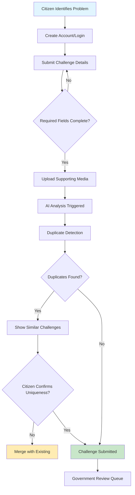

**Steps Detailed:**

1. **Problem Identification** (Citizen)
   - Citizen encounters a societal problem in their community
   - Decides to submit it to SamadhanX platform
   - Gathers relevant information and evidence

2. **Account Creation/Authentication** (Citizen)
   - Register with valid email and phone verification
   - Complete profile with location and basic details
   - Accept terms of service and platform guidelines

3. **Challenge Submission** (Citizen)
   - Fill out structured challenge form:
     - Problem title and description
     - Location details with map integration
     - Affected population estimate
     - Problem category selection
     - Urgency and impact assessment
   - Upload supporting media (photos, videos, documents)

4. **AI-Powered Analysis** (System)
   - Text analysis for problem classification
   - Severity and urgency scoring
   - Skill requirement extraction
   - Location-based context analysis
   - Generate embedding vectors for similarity matching

5. **Duplicate Detection** (System)
   - Compare with existing challenges using AI embeddings
   - Check geographic proximity for similar problems
   - Present potential duplicates to citizen
   - Allow citizen to confirm uniqueness or merge

6. **Submission Completion** (System)
   - Generate unique challenge ID
   - Send confirmation to citizen
   - Queue for government validation
   - Notify relevant government officers

### 1.2 Government Validation Workflow

**Actors**: Government Officer, AI System, Citizen

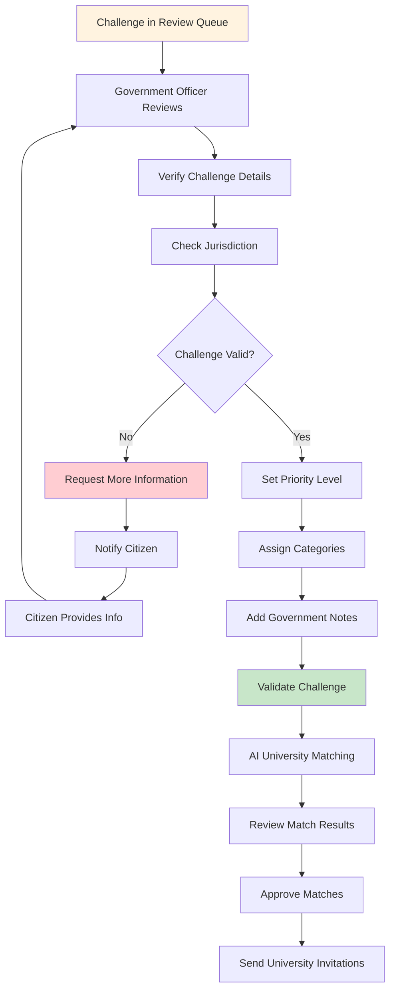

**Steps Detailed:**

1. **Queue Management** (Government Officer)
   - Access challenges assigned to their jurisdiction
   - Prioritize based on urgency, impact, and resources
   - Track review deadlines and SLA compliance

2. **Challenge Validation** (Government Officer)
   - Verify problem authenticity and scope
   - Confirm geographic jurisdiction
   - Assess government priority alignment
   - Check for policy implications

3. **Information Gathering** (Government Officer + Citizen)
   - Request additional details if needed
   - Validate location and affected population
   - Confirm problem persistence and relevance
   - Gather stakeholder input if required

4. **Classification and Prioritization** (Government Officer)
   - Set official priority level (Low/Medium/High/Critical)
   - Assign appropriate problem categories
   - Add government context and requirements
   - Set budget expectations and constraints

5. **University Matching Initiation** (Government Officer)
   - Review AI-generated university matches
   - Consider additional factors (location, past performance)
   - Approve or modify match recommendations
   - Set response deadlines for universities

### 1.3 Challenge Lifecycle Tracking

**Status Progression:**
```
DRAFT → SUBMITTED → AI_ANALYSIS → PENDING_REVIEW → VALIDATED → 
MATCHING → UNIVERSITY_INVITED → ACCEPTED → PROJECT_CREATED → 
[Project Status Tracking] → COMPLETED
```

**Alternative Paths:**
- `REJECTED` - Challenge deemed invalid or out of scope
- `DUPLICATE` - Merged with existing challenge
- `ON_HOLD` - Temporarily paused pending external factors
- `CANCELLED` - Withdrawn by citizen or cancelled by government

---

## 2. University Engagement Workflows

### 2.1 University Invitation and Response Workflow

**Actors**: University Admin, Faculty, AI System, Government Officer

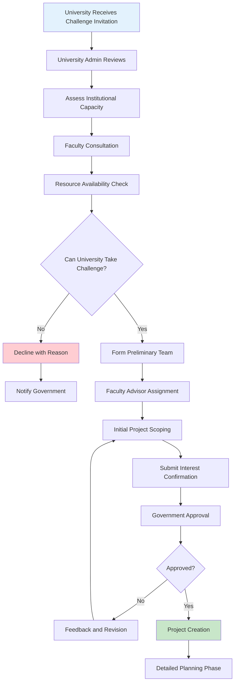

**Steps Detailed:**

1. **Invitation Reception** (University Admin)
   - Receive challenge invitation with match reasoning
   - Access detailed challenge information
   - Review government requirements and expectations
   - Check response deadline

2. **Institutional Assessment** (University Admin)
   - Evaluate alignment with university mission
   - Check available resources and capacity
   - Review potential faculty and student availability
   - Assess financial and time commitments

3. **Faculty Engagement** (Faculty + University Admin)
   - Identify relevant faculty members
   - Conduct preliminary feasibility discussions
   - Assess research alignment and interest
   - Determine supervision capacity

4. **Response Preparation** (University Team)
   - Form preliminary project team
   - Assign faculty advisor
   - Conduct initial problem analysis
   - Prepare capability statement

5. **Formal Response** (University Admin)
   - Submit acceptance or decline
   - Provide reasoning and initial approach
   - Commit to timeline and resources
   - Request any clarifications

### 2.2 Team Formation and Project Setup

**Actors**: Faculty Advisor, Students, University Admin

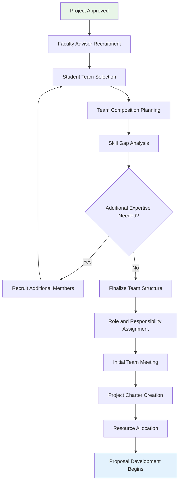

**Steps Detailed:**

1. **Faculty Advisor Selection** (University)
   - Identify faculty with relevant expertise
   - Confirm availability and interest
   - Assign primary and secondary advisors
   - Define advisor responsibilities

2. **Student Recruitment** (Faculty Advisor)
   - Open call for student participants
   - Review applications and qualifications
   - Conduct interviews if necessary
   - Select diverse, complementary team

3. **Team Structure** (Faculty Advisor + Students)
   - Define team roles and hierarchy
   - Establish communication protocols
   - Set meeting schedules and expectations
   - Create collaboration frameworks

4. **Project Initiation** (Team)
   - Detailed problem analysis
   - Literature review and research
   - Stakeholder identification
   - Initial solution brainstorming

---

## 3. Project Execution Workflows

### 3.1 Project Proposal and Approval Workflow

**Actors**: Project Team, Faculty Advisor, University Admin, Government Officer, Industry Partners

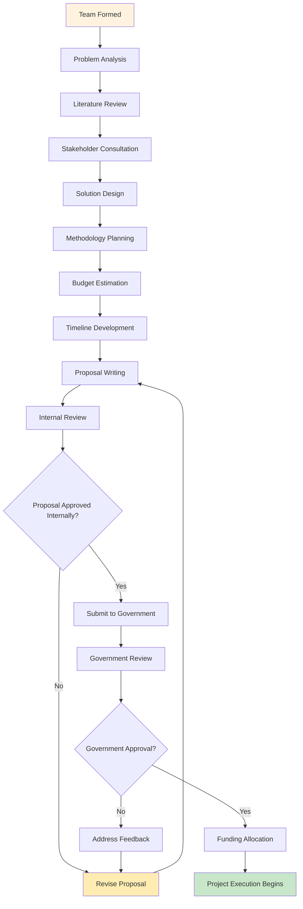

**Steps Detailed:**

1. **Research and Analysis Phase** (Project Team)
   - Comprehensive problem analysis
   - Stakeholder interviews and surveys
   - Technology and solution research
   - Feasibility assessment

2. **Solution Development** (Project Team + Faculty Advisor)
   - Brainstorm potential solutions
   - Evaluate technical feasibility
   - Consider resource constraints
   - Select optimal approach

3. **Proposal Preparation** (Project Team)
   - Executive summary and problem statement
   - Detailed methodology and approach
   - Timeline with milestones
   - Budget breakdown and justification
   - Expected outcomes and impact metrics
   - Risk assessment and mitigation plans

4. **Review and Approval Process**
   - Internal university review
   - Government evaluation
   - Industry partner consultation (if applicable)
   - Iterative refinement based on feedback

### 3.2 Project Execution and Milestone Tracking

**Actors**: Project Team, Faculty Advisor, Industry Mentors, Government Officer

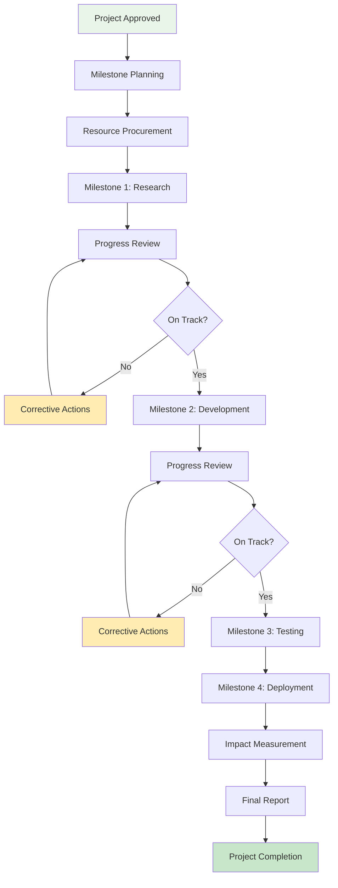

**Milestone Structure Example:**

1. **Milestone 1: Research and Design (Months 1-2)**
   - Complete literature review
   - Finalize technical approach
   - Create detailed design specifications
   - Deliverable: Technical design document

2. **Milestone 2: Development (Months 3-5)**
   - Build core solution components
   - Develop prototypes
   - Conduct initial testing
   - Deliverable: Working prototype

3. **Milestone 3: Testing and Validation (Months 6-7)**
   - User acceptance testing
   - Performance validation
   - Security and compliance checks
   - Deliverable: Test results and validation report

4. **Milestone 4: Deployment and Training (Months 8-9)**
   - Production deployment
   - User training and documentation
   - Stakeholder handover
   - Deliverable: Deployed solution

5. **Milestone 5: Impact Assessment (Months 10-12)**
   - Collect usage and impact data
   - Stakeholder feedback collection
   - Sustainability planning
   - Deliverable: Impact assessment report
---

## 4. Industry Partnership Workflows

### 4.1 Industry Partner Onboarding Workflow

**Actors**: Industry Representative, Platform Admin, University Admin

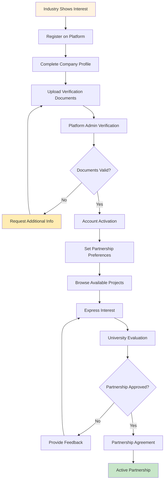

**Steps Detailed:**

1. **Initial Registration** (Industry Representative)
   - Create corporate account
   - Provide basic company information
   - Specify areas of expertise and interest
   - Define collaboration preferences

2. **Profile Completion** (Industry Representative)
   - Detailed company profile
   - CSR focus areas and budget
   - Previous collaboration experience
   - Preferred partnership types (funding, mentorship, resources)

3. **Verification Process** (Platform Admin)
   - Validate company credentials
   - Check business registration
   - Verify CSR authorization
   - Confirm contact person authority

4. **Partnership Matching** (Industry Representative + Universities)
   - Browse available projects
   - Review project proposals
   - Express interest in specific projects
   - Initiate partnership discussions

### 4.2 Partnership Agreement and Execution

**Actors**: Industry Partner, University, Legal Teams, Government Officer

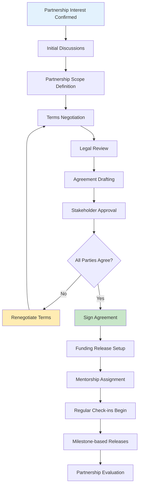

**Partnership Types:**

1. **Funding Partnership**
   - Financial support for project execution
   - Milestone-based fund releases
   - Budget oversight and reporting
   - ROI and impact measurement

2. **Mentorship Partnership**
   - Industry expert guidance
   - Regular mentoring sessions
   - Technical advisory support
   - Career guidance for students

3. **Resource Partnership**
   - Technology platform access
   - Laboratory and equipment sharing
   - Software licenses and tools
   - Infrastructure support

4. **Deployment Partnership**
   - Solution pilot testing
   - Market validation support
   - Scaling and commercialization
   - Go-to-market strategy

---

## 5. Government Oversight Workflows

### 5.1 Progress Monitoring and Compliance

**Actors**: Government Officer, Project Teams, University Admin

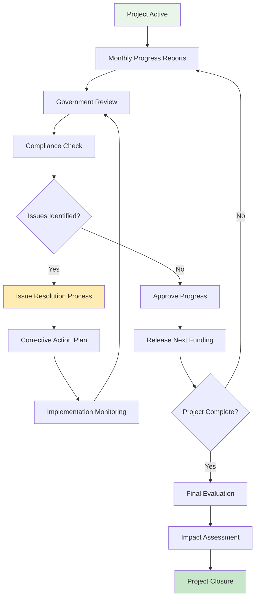

**Monitoring Activities:**

1. **Progress Tracking**
   - Monthly progress reports
   - Milestone completion verification
   - Budget utilization monitoring
   - Timeline adherence assessment

2. **Quality Assurance**
   - Deliverable review and approval
   - Technical standard compliance
   - Stakeholder satisfaction surveys
   - Risk assessment and mitigation

3. **Impact Evaluation**
   - Beneficiary feedback collection
   - Quantitative impact measurement
   - Long-term sustainability assessment
   - Knowledge transfer evaluation

### 5.2 Policy Impact and Learning

**Actors**: Government Officers, Policy Makers, Research Teams

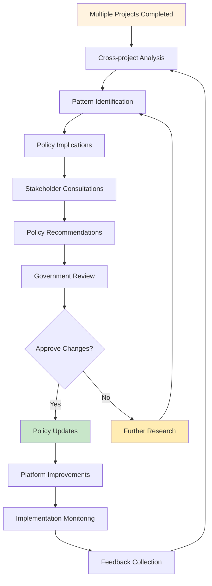

---

## 6. Impact Measurement Workflows

### 6.1 Impact Data Collection and Analysis

**Actors**: Project Teams, Beneficiaries, Government Officers, Research Partners

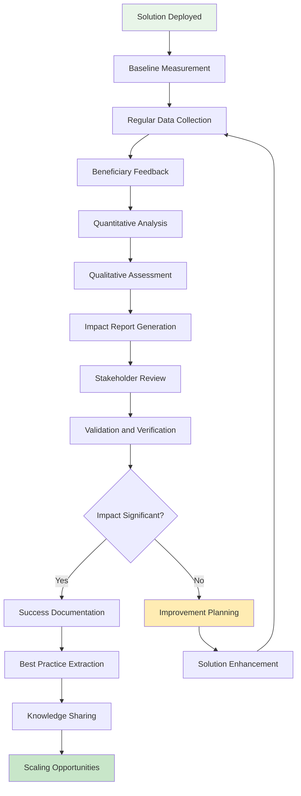

**Impact Measurement Framework:**

1. **Social Impact**
   - Lives improved or affected
   - Quality of life indicators
   - Community engagement levels
   - Behavioral change measures

2. **Economic Impact**
   - Cost savings generated
   - Economic opportunities created
   - Revenue impact on beneficiaries
   - Return on investment

3. **Environmental Impact**
   - Resource consumption changes
   - Environmental quality improvements
   - Carbon footprint reduction
   - Sustainability indicators

4. **Technological Impact**
   - Innovation advancement
   - Technology adoption rates
   - Skill development outcomes
   - Knowledge transfer success

### 6.2 Continuous Improvement Cycle

**Actors**: All Stakeholders

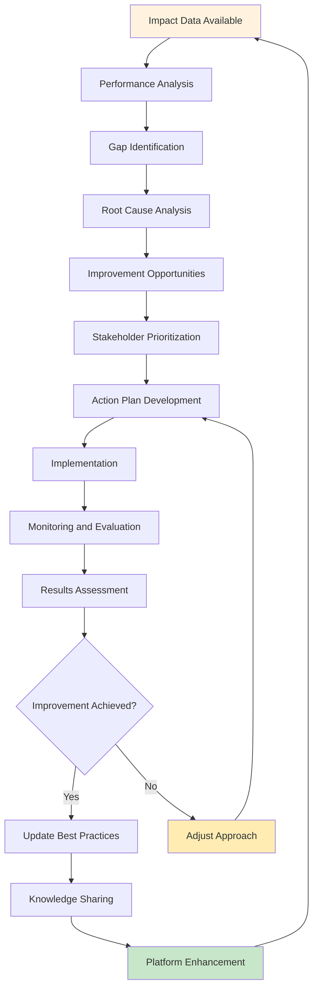

---

## Workflow Integration and Orchestration

### Cross-Workflow Dependencies

```mermaid
graph LR
    A[Challenge Submission] --> B[Government Validation]
    B --> C[University Matching]
    C --> D[Project Creation]
    D --> E[Team Formation]
    E --> F[Proposal Development]
    F --> G[Industry Partnership]
    G --> H[Project Execution]
    H --> I[Impact Measurement]
    I --> J[Knowledge Sharing]
    J --> K[Platform Improvement]
    
    style A fill:#e1f5fe
    style E fill:#e8f5e8
    style G fill:#fff3e0
    style I fill:#f3e5f5
    style K fill:#c8e6c9
```

### Notification and Communication Flows

**Automated Notifications:**
- Status changes and updates
- Deadline reminders and alerts
- Approval requests and responses
- Milestone completions
- Impact measurement results

**Communication Channels:**
- In-platform messaging system
- Email notifications for critical updates
- SMS alerts for urgent items
- Dashboard updates and progress tracking
- Regular reporting and analytics

### Error Handling and Exception Management

**Common Exception Scenarios:**

1. **Challenge Rejection Recovery**
   - Clear feedback and improvement guidance
   - Resubmission pathway with modifications
   - Alternative solution exploration

2. **University Capacity Issues**
   - Alternative university recommendations
   - Project scope adjustment options
   - Timeline extension procedures

3. **Project Delivery Challenges**
   - Risk mitigation protocols
   - Resource reallocation procedures
   - Stakeholder communication plans

4. **Partnership Dissolution**
   - Graceful partnership termination
   - Asset and knowledge transfer
   - Alternative partnership matching

### Performance Metrics and SLAs

**Key Performance Indicators:**

1. **Process Efficiency**
   - Challenge-to-project conversion rate: >60%
   - Average validation time: <7 days
   - University response time: <14 days
   - Project completion rate: >80%

2. **Quality Metrics**
   - Stakeholder satisfaction: >4.0/5.0
   - Solution effectiveness: >70%
   - Impact achievement: >75% of targets
   - Knowledge transfer success: >80%

3. **Engagement Metrics**
   - Active user retention: >85%
   - Repeated participation: >40%
   - Cross-role collaboration: >60%
   - Platform utilization: >75%

This comprehensive workflow documentation ensures all stakeholders understand their roles, responsibilities, and the interconnected nature of the SamadhanX ecosystem, enabling effective collaboration and successful societal impact.